# Store Sales Analysis

#### Portfolio Project of a retail chain sales analysis with deploy via Telegram Bot
##### Author: Andrew Laganaro

## 📜 About this project
### Business Understanding

>"The CFO of a retail chain held a meeting with his managers and talked about that the chain is in expansion phase and that there is still no sales analysis model for the chain as a whole. 
>
>The stores are divided by region and there's a lot of them. When having an easily accessible predictive model the CFO team will decide from which regions the expansion should start.
>
>That being said he asked you to do a sales analysis report for the next 8 weeks (2 months) that would cover the whole chain to help him and his team on the decision making process."

#### 🚀 Built with
* 🐍Python
* 📘Poetry
* 🔌FastAPI
* 💻Streamlit
* 🐼Pandas
* 📝Numpy
* 📈Matplotlib
* 📉Seaborn
* 📊Scikit-Learn
* 🪐Jupyter Notebook
* 🐳Docker
* 🖼Drawio

<p align="left">
  ▶<kbd><a href="https://github.com/AndrewLaganaro/Store_Sales_Analysis/blob/main/README.md" alt="Brazilian">
  </a></kbd>◀
</p>

#### 🎯 General project status


#### 💻🐳🐍 App detailed Scheme

Composed of three main parts, Frontend, Backend and Telegram bot, the Frontend is the main interface to the web while the Backend is the logic of the project where occurs the data science pipeline, message parsing and prediction. The telegram bot is where the user can interact with the project via sending messages with specific commands.

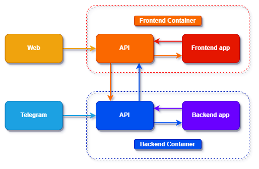

#### 💻🔌🐍Api detailed Scheme

The ```/Telegram``` endpoint only communicates with the Telegram servers and thereby with the Telegram bot, whereas the ```/Predict``` endpoint is exposed to the web so the frontend can interact with and send requests to it as desired by the user from the wed application.

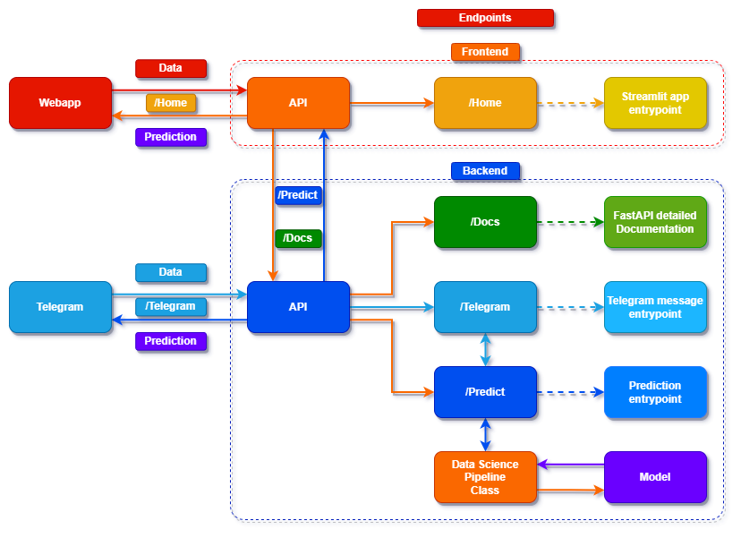

The Frontend application has direct access only to the ```/Home``` endpoint, where lives the main page of the application, and has indirect access to the ```/Predict``` and ```/Docs``` endpoints, this last provided by FastAPI that details the backend endpoints and their respective functionality.

#### ✈️🤖🐍 Telgram Bot Functionality

A telelgram bot was created to deploy the analysis and interact with the user, mainly because of its practicality and ease of use, It could be use by the CFO team to get predictions in a easy and fast way.

When accessing the Telegram Bot ```@Store_Sales_Analysis_bot``` the user can send the following messages:

```/start``` - Starts the bot
```/22``` - Predicts the sales for the store number 22 of the retail chain
```/41``` - Predicts the sales for the store number 41 of the retail chain

Example of use:
```
User > /start
User > /22
Bot  > Store Number 22 will sell R$157,217.804 in the next 8 weeks
 ```

##### ⭐️ Future commands to be added

```/all``` - Predicts the sales for all stores of the retail chain together
```/help``` - Shows a help message about the bot

### 📝 How to use this Project

#### 💻 Pre-requisites

Before starting, make sure you've met the following requirements:

* You have installed the latest version of Python.
    * At least Python 3.6 is required.
    * Python 3.8 is recommended.

#### 🚀 Creating a virtual environment

- 💻🐍 Create a virtual environment for this project.

```
...
📁 Data Science ⬅️ 💻 Start your terminal here 💻
    📁 Python_Studies
    ...
```
```
python -m venv Store_Sales_Analysis_env
```
```
...
📁 Data Science
    📁 Python_Studies
    📁 Store_Sales_Analysis_env
    ...
```

- 🐍⚙️ Python venv activation

How you activate your virtual environment depends on the OS you’re using.

- 💻 Windows venv activation
```
# In cmd
Store_Sales_Analysis_env\Scripts\activate.bat
```
```
# In PowerShell
Store_Sales_Analysis_env\Scripts\Activate.ps1
```
- 💻 Linux and MacOS venv activation
```
$ source Store_Sales_Analysis_env/bin/activate
```

#### 🚀 Installing required libraries

On Project folder, look for the file `requirements.txt` inside ```Backend/Build``` and ```Frontend/Build``` folders and run the following command for each one:

```
pip install -r requirements.back.txt
pip install -r requirements.front.txt
```
## ☕📊 Reading the full analysis

The **full analysis** is in the file `Store_Sales_Analysis.ipynb` inside the Notebooks folder.

It has **WAY** more details than what is presented here. Be sure to take a look later.

### ☕📊 Analysis

In order to illustrate we will be using only the main hypothesis and points brought up and developed by the analysis here in this presentation.

First we're going to start with a Numerical and Categorical Analysis of the data.

#### 📈 Numerical Attributes

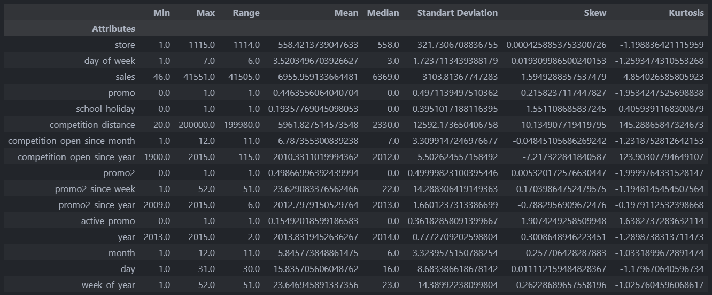

#### 🔎 It's a lot of data, but what is our **focus**?
- Our main object of study is **sales**, so the **'Sales'** column is the one we will analyze

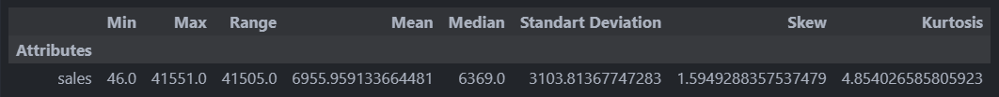

- Close Median and Mean, indicates that we do not have a very large displacement from normal distribution curve
- This is confirmed by the Skew metric which is very close to 0, which indicates that the data is distributed very close to the normal and with little left or right skew
- The Skew metric also indicates a subtle slope to the left, indicating what we call a **positive slope**
- Kurtosis metric is greater than 0, which indicates that we have a higher peak in the distribution

Let's visualize all this with a distplot:

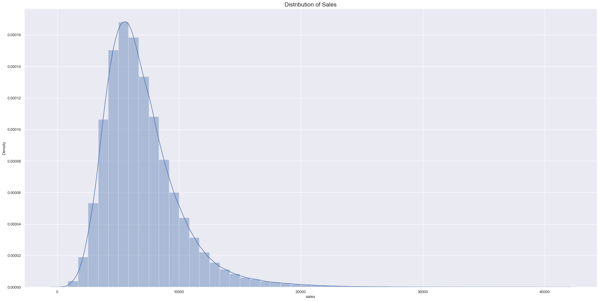

As we thought, the distribution is mostly normal and skewed to the left.

#### 📉 Categorical Attributes

The best variables to analyze are **'state_holiday'**, **'assortment'** and **'store_type'**, as they have few variations (a,b,c etc) and are more relevant to our object of study.

- Let's evaluate sales with respect to holidays:

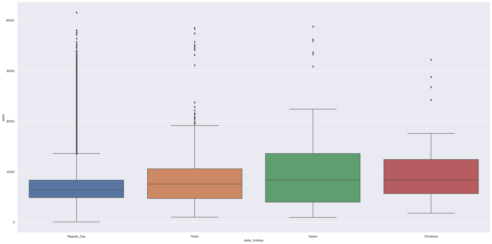

- Let's analyze the three variables **'state_holiday'**, **'assortment'** and **'store_type'** in the charts:

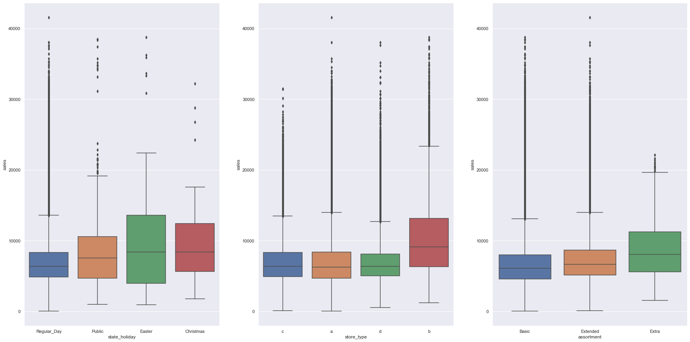

#### 💰📆Sales per Holiday:

* The medians of the 3 types of holidays (**public**, **Easter** and **Christmas**) are very close
* On **public** and **Easter** holidays we have a balance of sales in the upper and lower quartiles (25th and 75th)
* On **Christmas** holidays we have more sales in the top quartile (75)
* On **Easter** holidays we have the highest maximum sales of all holidays
     - We also have the widest range of sales among all holidays, indicating that customers of all types buy products
* The difference in overall sales volume and maximum sales between normal days and holidays is very visible, with the range tripling at Easter and doubling at Christmas

#### 💰🏢Sales by store type:

* Store type **B** has the most sales in the top quartile (75)
     - Also has the highest maximum value among all stores
     - It also has the highest number of upper outliers among all stores, indicating large sales
     - It may indicate that it is located in more populous and wealthy neighborhoods/cities
     - It may indicate that it is focused on more expensive products and a richer audience

* Store types **A** and **C** have a balance of sales in the upper and lower quartiles (25th and 75th) and are both very similar in level of sales
* Store type **A** has a lower median sales than all other stores
     - However, its maximum sales value is practically equal to the maximum sales value of stores type **C**
     - It may indicate that both are located in close neighborhoods (by the amount of sales, it indicates similar purchasing power), but with significant differences in prices/cost of living
     - It may indicate that they are the most common type of stores, which make up the bulk of the profit on sales as they serve most customers with medium/middle-high incomes
     - For this reason, they seem to be the most important stores in the chain

* Store type **D** has a balance of sales in the upper and lower quartiles (25th and 75th)
     - Has the highest concentration of sales value among all stores
     - Has the lowest maximum sales among all stores
     - It may indicate that it serves a more specific audience or that it is a newer store model, which has not yet been proven to the public
     - Or that works in small cities, with little price variation and few promotions
     - There may also be a large number of competitors close to the type D store, which drastically reduces the profit
     - It seems to be the least profitable store on the network, as it is cheaper and only sells products in a specific price range, limiting revenue
     - Replacement of the **D** type store with **A** and **C** stores, with a greater variety of sales and prices, may be an option

#### 📦💰 Sales by type of stock:

* The **Basic** and **Extended** stock types have a similar and balanced distribution in the upper and lower quartiles (25th and 75th)
     - **Extended** has more sales than **Basic** in absolute numbers

* The **Extra** inventory type has a balanced sales concentration in the upper and lower quartiles (25 and 75)
     - However it is the type of stock that has the highest maximum sales among all types of stock
     - Indicating that the product may undergo frequent promotions
     - Or have products with higher prices
     - Or have the most popular products from the entire network

### ☕📝🧐 Hypotheses

To get to Exploratory Data Analysis and know which way to go, let's make a list of hypotheses based on three questions to analyze in the next part of the project:

- What is the modeled phenomenon?
- What are the agents that act on the phenomenon of interest?
- What are the attributes of those agents?

#### 📝 Here is our Hypotheses mind map:

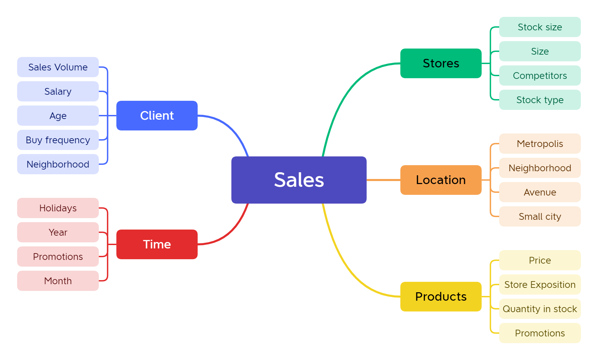

#### 📊 Stores with longer active promotions should sell more.
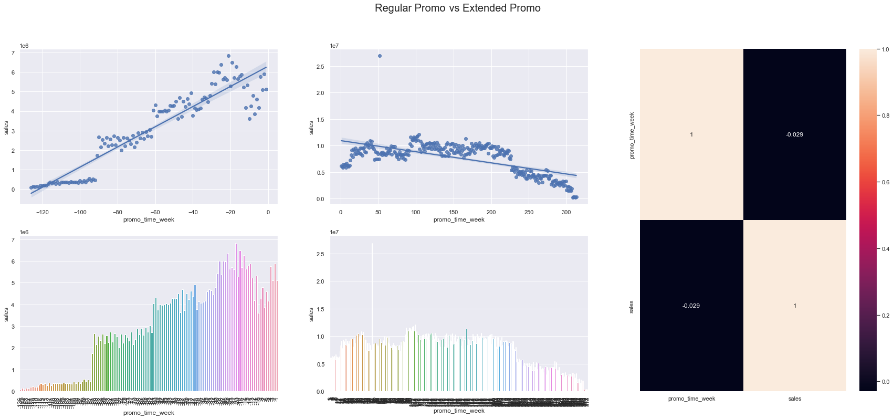

Hypothesis 1 **False**, Stores with **promotions active for longer** sell **less**, after a while sales drop in the general scenario, despite rising initially

#### 📊 Stores with closer competitors should sell less.
#### Let's visualize the scatter plot of sales by distance of competitors:
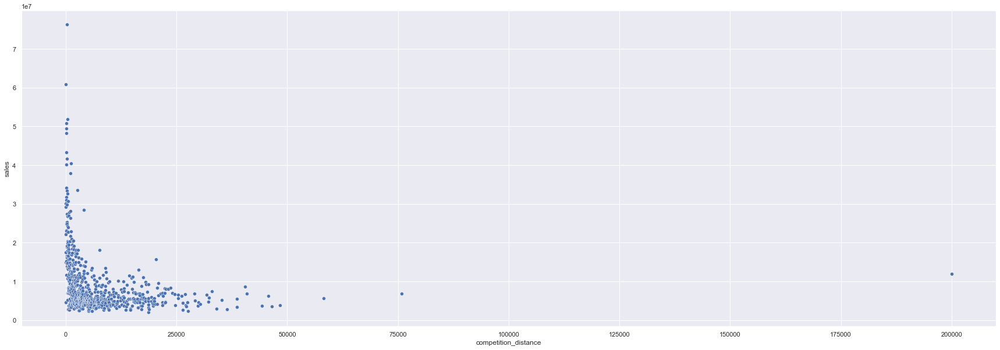
- We have much more sales in stores with closer competitors
- The further away from competitors, the less sales are seen

#### 📊 Let's see a bar chart grouping stores by distance of competitors
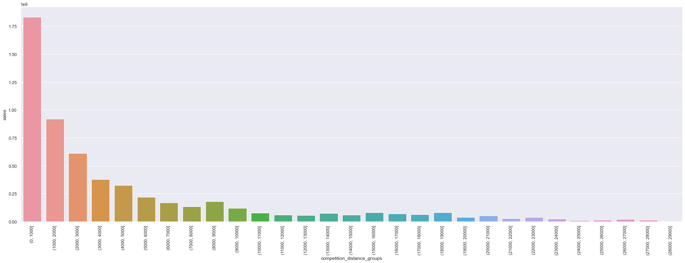
- This chart confirms the first scatter plot, the more close competitors the more sales happen

#### 📊 Now with a correlation plot:
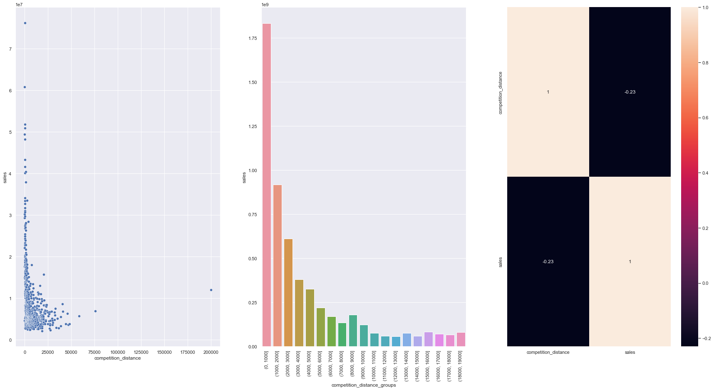

With negative correlation, Hypothesis 2 is **False**, Stores with **closest competitors** sell **more**.

#### 📊 Stores with longer competitors should sell more.

#### 📊 Let's look at the three graphs together to draw conclusions:
- Let's see a barplot of sales by months of competition, over the last 10 years (120 months)
- Let's do a polynomial regression plot to see the sales trend as the months go by

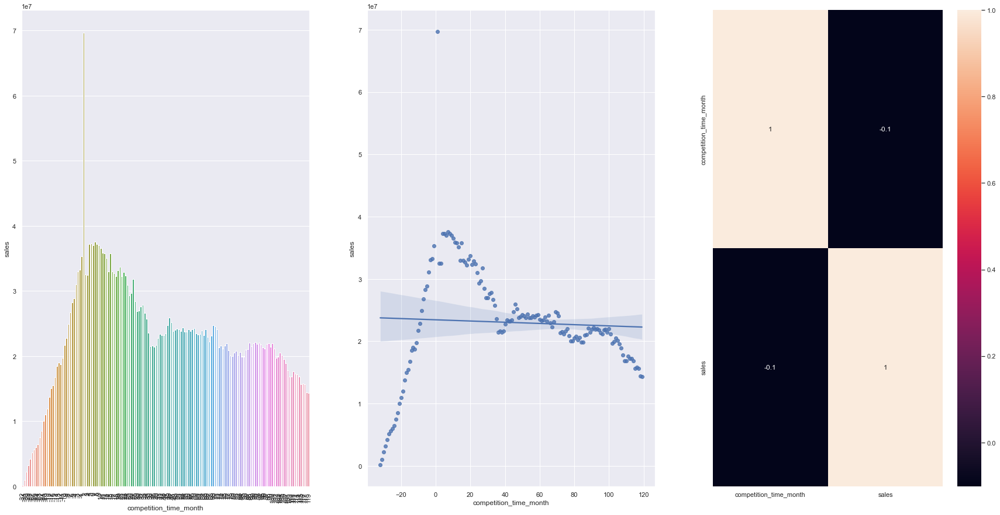
- From the first two graphs, we have a trend that stores with **more recent competitors** sell more

However, Hypothesis 3 is **False**, Stores with **longer competitors** sell **less** in the general scenario, despite selling more when competition is recent, it soon stabilizes and drops

#### 📊 Stores should sell less on weekends.

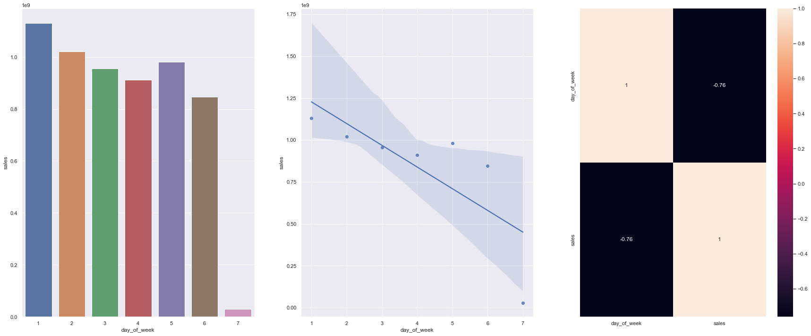

Hypothesis 4 is **True**, Stores sell less on weekends, especially on Sunday. It may reflect the sector/type of products in which the retail chain works. The negative correlation is very strong, above 70%.

#### 📊🧩 Model Performance

How do we evaluate model performance against business performance? That is, did we get performance improvements with the model? How to gauge this?

It is at this stage that we verify if all the training and refinement of the model was worth it in relation to what we already had in the business.

#### 📊⚙️🧩 Model Performance vs Baseline Methods

For this, the business problem must already have some kind of previous forecast metric, through which it will be possible to evaluate the performance of the model. 

Since in this case we don't have something coming directly from the business, we're going to use the baseline model assuming it came ready with the problem and also the model metrics to predict revenue increments along with best and worst case.

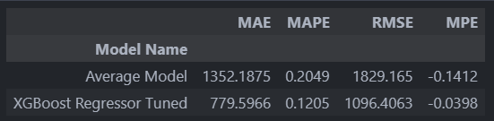
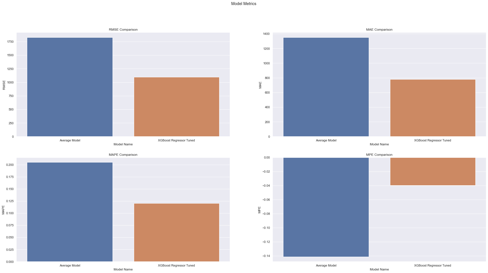

As the data shows us, the final model is considerably better than the baseline model, cutting the RMSE by almost half when compared to it, and also outperforming it in all other metrics.

#### 📉 Let's see the error distribution per prediction:

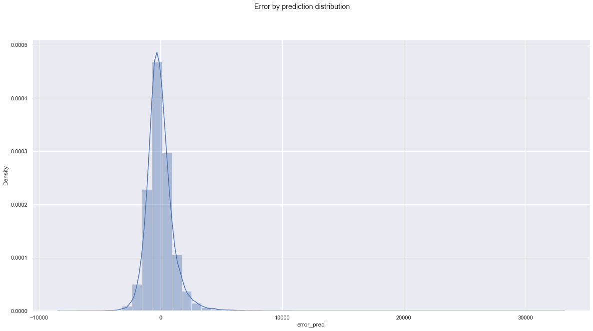

#### ☕📊 Final Report

Here we will see what the model did to improve business performance, making an overall revenue forecast for the entire retail chain.

#### 🏢📊 Model Performance in Business
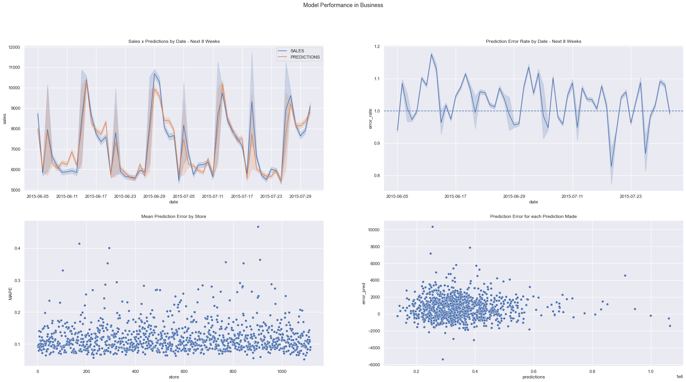

#### 🏢💰 Business Performance Gain

We have the best and worst sales scenario for the entire store network, adding up all the stores, in the next 8 weeks.


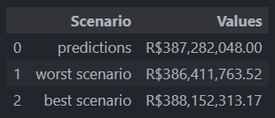

With this, we conclude that after the analysis, the selected features, the trained model and its refined parameters, that the final model has a **higher success rate** than the method used **previously** in **sales prediction**.

#### 💻 Currently at version 1.0.0

- [x] ```/Telegram``` endpoint available
- [x] ```/Predict``` endpoint available
- [x] Data Science Pipeline Class
- [x] Model available
- [x] Backend main API
    - [x] Json integrity check
    - [x] "Welcome" ``` / ``` endpoint while frontend isn't ready
- [x] Store number-only request with '**/number**', eg: ```/25```
- [x] API detailed Scheme
- [x] APP detailed Scheme
- [x] API working on Flask

#### ⭐️ Features to be added

- [ ] Separate the main notebook into little ones, by chapters
- [ ] Streamlit Web App (frontend)
- [ ] Transition from Flask to FastAPI
- [ ] Add a database to the project to register predictions
- [ ] Transition from Store number-only request to File request
- [ ] Backend main API
    - [ ] Add a function to read .json files trough the API via Telegram messages
        - This will guarantee that we can always send new data to the API
- [ ] Test communication between back and frontend containers

(generated with [Data\_Science\_Framework](https://github.com/AndrewLaganaro/Data_Science_Framework))

(modified from [Cookiecutter-Datascience](https://drivendata.github.io/cookiecutter-data-science/))