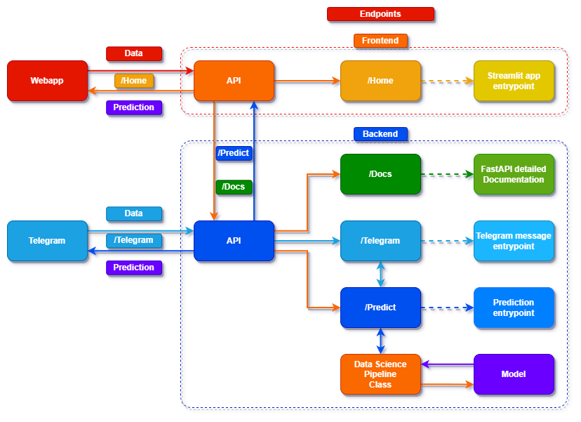
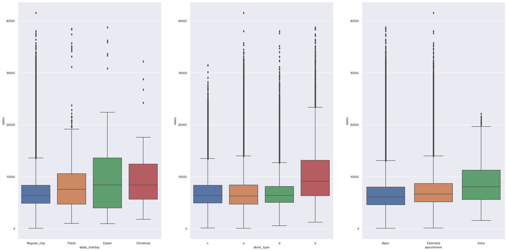
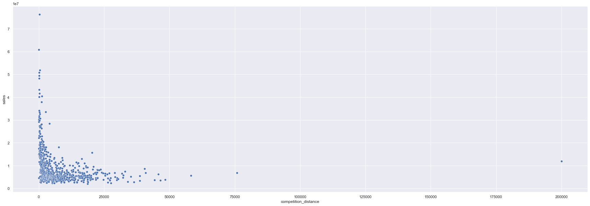
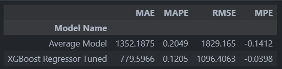
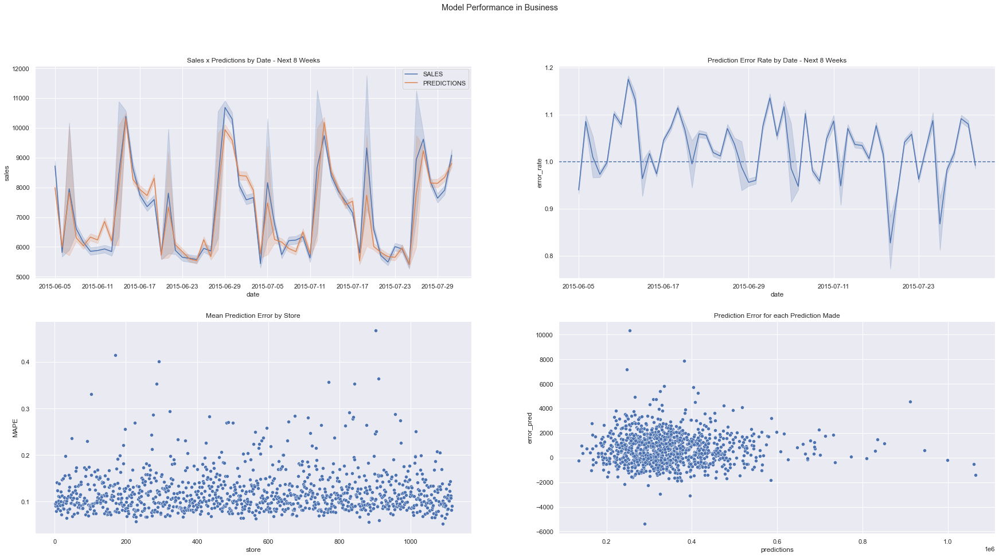
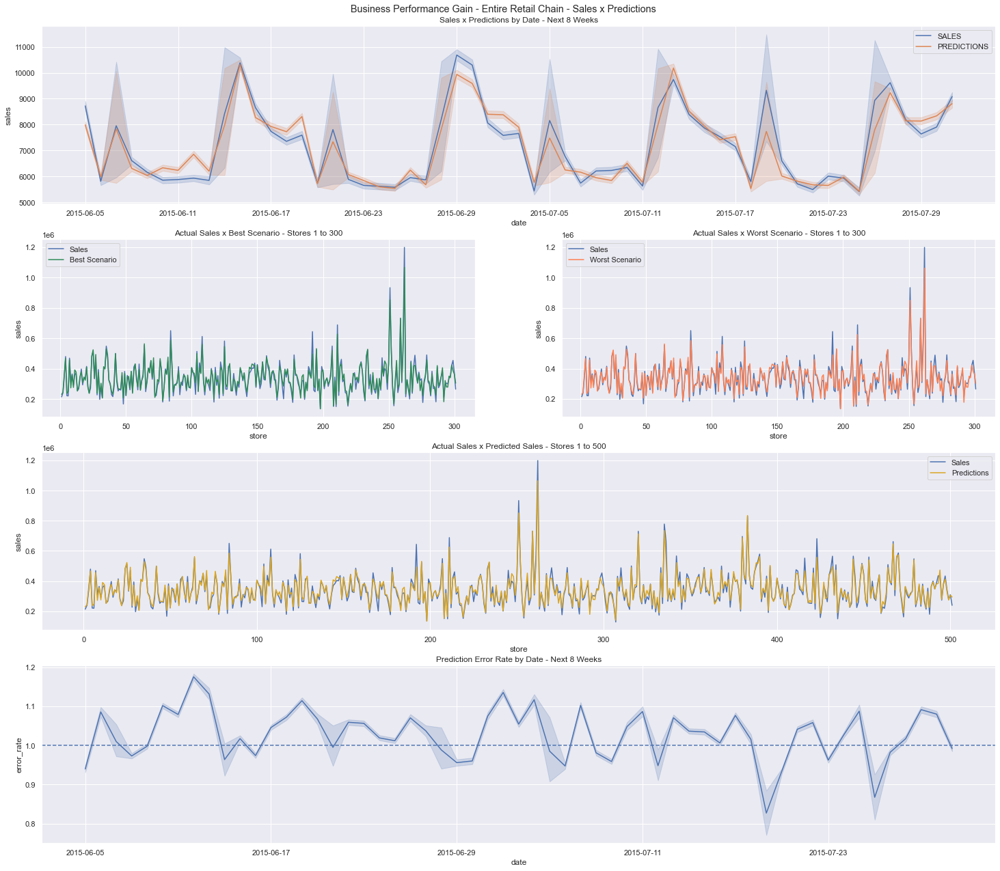

---

# Análise de Vendas de Rede de Lojas

#### Pojeto de Portfolio sobre uma análise de vendas de uma rede de varejo com deploy via REST API e Bot do Telegram

##### Readme In English <p align="left"> ▶<kbd><a href="https://github.com/AndrewLaganaro/Store_Sales_Analysis/blob/main/README.en.md" alt="American"> </a></kbd>◀ </p>

#### [](https://andrewcode.herokuapp.com)

##### Author: Andrew Laganaro

---

## 📜 Sobre o projeto
### Entendimento de Negócio

>"O CFO de uma rede de varejo realizou uma reunião com seus gestores e falou que a rede está em fase de expansão e que ainda não existe um modelo de análise de vendas para a rede como um todo.
>
>As lojas estão divididas por região e são muitas. Ao ter um modelo preditivo de fácil acesso, a equipe do CFO decidirá de quais regiões a expansão deve começar.
>
>Dito isso, ele pediu que você fizesse um relatório de análise de vendas para as próximas 8 semanas (2 meses) que abrangeria toda a cadeia para ajudar ele e sua equipe no processo de tomada de decisão."

#### 🚀 Construído com
* 🐍Python
* 📘Poetry
* 🔌FastAPI
* 💻Streamlit
* 🐼Pandas
* 📝Numpy
* 📈Matplotlib
* 📉Seaborn
* 📊Scikit-Learn
* 🪐Jupyter Notebook
* 🐳Docker
* 🖼Drawio

### 🛠 Projetos

  [](https://github.com/AndrewLaganaro/Store_Sales_Analysis)
  
  [](https://github.com/AndrewLaganaro/Data_Science_Framework)
  
  [](https://github.com/AndrewLaganaro/Data_Science_Classes)

####  ⬇️ Dá uma olhada no meu Portfolio ⬇️
  
  [](https://andrewcode.herokuapp.com)
  
#### 🎯 Status geral do projeto


#### 💻🐳🐍 Esquema detalhado do App

Composto por três partes principais, Frontend, Backend e Telegram bot, o Frontend é a principal interface visual na web enquanto o Backend é a lógica do projeto, onde ocorrem o pipeline de data science, a análise de mensagens e a previsão das vendas. O bot do telegram é onde o usuário pode interagir com o projeto enviando mensagens com comandos específicos.


#### 💻🔌🐍 Esquema detalhado da Api

O endpoint ```/Telegram``` só se comunica com os servidores do Telegram e, portanto, com o bot do Telegram, enquanto o endpoint ```/Predict``` é exposto à web para que o frontend possa interagir e enviar solicitações para ele conforme desejado pelo usuário do aplicativo wed.



A aplicação Frontend tem acesso direto apenas ao endpoint ```/Home```, onde fica a página principal da aplicação, e tem acesso indireto aos endpoints ```/Predict``` e ```/Docs```, este último fornecido pelo FastAPI que detalha os endpoints de backend e suas respectivas funcionalidades.

#### ✈️🤖🐍Esquema detalhado do Bot no Telgram

Um bot de Telegram foi criado como deploy da análise e para interagir com o usuário, foi escolhido principalmente por sua praticidade e facilidade de uso, podendo ser utilizado pela equipe do CFO para obter previsões de forma fácil e rápida.

Ao acessar o Telegram Bot ```@Store_Sales_Analysis_bot``` o usuário pode enviar as seguintes mensagens:

```/start``` - Inicia o bot
```/22``` - Prevê as vendas para a loja número 22 da rede de varejo
```/41``` - Prevê as vendas para a loja número 41 da rede de varejo

Exemplo de uso:
```
Usuário > /start
Usuário > /22
Bot     > A Loja Número 22 venderá R$ 157.217,804 nas próximas 8 semanas
  ```

##### ⭐️ Comandos futuros a serem adicionados

```/all``` - Prevê as vendas de todas as lojas da rede de varejo juntas
```/help``` - Mostra uma mensagem de ajuda sobre o bot

### 📝 Como usar este projeto

#### 💻 Pré-requisitos

Antes de começar, verifique se você atendeu aos seguintes requisitos:

* Você instalou a versão mais recente do Python.
     * É necessário pelo menos o Python 3.6.
     * O Python 3.8 é recomendado.
* Você tem o Telegram instalado.

#### 🚀 Criando um ambiente virtual

- 💻🐍 Crie um ambiente virtual para este projeto.
```
...
📁 Data Science ⬅️ 💻 Inicie o seu terminal aqui 💻
    📁 Python_Studies
    ...
```
```
python -m venv Store_Sales_Analysis_env
```
```
...
📁 Data Science
    📁 Python_Studies
    📁 Store_Sales_Analysis_env
    ...
```

- 🐍⚙️ Ativação do Python venv

Como você ativa seu ambiente virtual depende do sistema operacional que você está usando.

- 💻 Ativação do venv no Windows 
```
# In cmd
Store_Sales_Analysis_env\Scripts\activate.bat
```
```
# In PowerShell
Store_Sales_Analysis_env\Scripts\Activate.ps1
```
- 💻 Ativação do venv no Linux e MacOS
```
$ source Store_Sales_Analysis_env/bin/activate
```

#### 🚀 Instalando as bibliotecas necessárias

Na pasta Project, procure o arquivo `requirements.txt` dentro das pastas ```Backend/Build``` e ```Frontend/Build``` e execute o seguinte comando para cada um:

```
pip install -r requirements.back.txt
pip install -r requirements.front.txt
```
## ☕📊 Lendo a análise completa

A **análise completa** deste projeto está no arquivo `Store_Sales_Analysis.ipynb` dentro da pasta Notebooks.

Lá tem **MUITO** mais detalhes do que o foi apresentado aqui. Lembre-se de dar uma olhada mais tarde.

### ☕📊 Análise

Para ilustrar, usaremos apenas as principais hipóteses e pontos levantados e desenvolvidos pela análise aqui nesta apresentação.

Primeiro vamos começar com uma Análise Numérica e Categórica dos dados.

#### 📈 Atributos Numéricos


#### 🔎 São muitos dados, mas qual o nosso **foco**?
- Nosso objeto de estudo principal são as **vendas**, então a coluna **'Sales'** é a que vamos analisar


- Mediana e Média próximas, indica que não temos um deslocamento muito grande da curva normal de distribuição
- Isso é confirmado pela métrica de Skew que é muito próxima de 0, o que indica que os dados estão distribuídos muito próximos da normal e com pouca inclinação pra esquerda ou pra direita
- A métrica Skew também indica uma sutil inclinação para a esquerda, indicando o que chamamos de inclinação positiva
- A métrica de Curtose é maior que 0, o que indica que temos um pico mais alto na distribuição

Vamos visualizar tudo isso com um gráfico de dispersão:


Como imaginamos, a distribuição é em maioria normal e inclinada à esquerda.

#### 📉 Atributos Categóricos

As melhores variáveis para analisarmos são 'state_holiday', 'assortment' e 'store_type', pois tem poucas variações (a,b,c etc) e são mais relevantes para o nosso objeto de estudo.

- Vamos avaliar as vendas com relação aos feriados:


- Vamos analisar as três variáveis 'state_holiday', 'assortment' e 'store_type' nos gráficos:



#### 💰📆 Vendas por feriado:

* As medianas dos 3 tipos de feriados (**público**, **páscoa** e **natal**) são muito próximas
* Nos feriados **públicos** e de **páscoa** temos um equilíbrio de vendas nos quartis superior e inferior (25 e 75)
* Nos feriado de **natal** temos mais vendas no quartil superior (75)
* Nos feriados de **páscoa** temos a maior máxima de vendas entre todos os feriados
    - Também temos o maior range de vendas entre todos os feriados, indicando que clientes de todos os tipos compram produtos
* A diferença em volume geral de vendas e vendas máximas entre os dias normais e feriados é muito visível, com o range chegando a triplicar na páscoa e dobrar no natal

#### 💰🏢 Vendas por tipo de loja:

* O tipo de loja **B** tem mais vendas no quartil superior (75)
    - Também possui o valor máximo mais alto entre todas as lojas
    - Também possui o maior número de outliers superiores entre todas as lojas, indicando grandes vendas
    - Pode indicar que fica em bairros/cidades mais populosas e ricas
    - Pode indicar que é focada em produtos mais caros e público mais rico

* Os tipos de loja **A** e **C** tem um equilíbrio de vendas nos quartis superior e inferior (25 e 75) e são ambos muito semelhantes em nível de vendas
* O tipo de loja **A** tem uma mediana de vendas inferior a todas as outras lojas
    - No entanto seu valor máximo de vendas é praticamente igual ao valor máximo de vendas das lojas tipo **C**
    - Pode indicar que ambas ficam em bairros próximos (pela quantidade de vendas, indica poder de compra similar), mas com sensíveis diferenças de preços/custo de vida
    - Pode indicar que são o tipo mais comum de lojas, que compõe o grosso do lucro nas vendas por atenderem a maior parte dos clientes com rendas média/média-alta
    - Por esse fator, parecem ser as lojas mais importantes da rede

* O tipo de loja **D** tem um equilíbrio de vendas nos quartis superior e inferior (25 e 75)
    - Possui a maior concentração de valor de vendas entre todas as lojas
    - Possui a menor máxima de vendas entre todas as lojas
    - Pode indicar que atende um público mais específico ou que seja um modelo de loja mais novo, que ainda não se provou para o público
    - Ou que funciona em cidades pequenas, com pouca variação de preços e poucas promoções
    - Pode também haver um grande número de concorrentes próximos da loja tipo D, o que reduz o lucro drasticamente
    - Parece ser a loja que menos dá lucro na rede, pois é mais barata e só vende produtos de uma faixa de preço especifíca, limitando o faturamento
    - Substituição da loja tipo **D** por lojas tipo **A** e **C**, com maior variedade de vendas e preços pode ser uma opção

#### 📦💰 Vendas por tipo de estoque:

* Os tipos de estoque **Basic** e **Extended** tem distribuição similar e equilibrada nos quartis superior e inferior (25 e 75)
    - **Extended** tem mais vendas que **Basic** em números absolutos

* O tipo de estoque **Extra** tem concentração de vendas equilibrada nos quartis superior e inferior (25 e 75)
    - No entanto é o tipo de estoque que maior máxima de vendas entre todos os tipos de estoque
    - Indicando que o produto pode passar por frequentes promoções 
    - Ou ter produtos com preços mais altos
    - Ou ter os produtos mais populares de toda a rede

### ☕📝🧐 Hipóteses de Negócio

Para chegarmos na Análise Exploratória de Dados e sabermos por qual caminho vamos nos guiar, vamos fazer uma lista de hipóteses a partir de três perguntas para analisar na próxima parte do projeto:

- Qual o fenômeno modelado?
- Quais são os agentes que atuam sobre o fenômeno de interesse?
- Quais são os atributos dos agentes?

#### 📝 Aqui está o nosso mapa mental de hipóteses:


#### 📊 Lojas com promoções ativas por mais tempo devem vender mais.


Hipótese 1 é **Falsa**, Lojas com **promoções ativas por mais tempo** vendem **menos**, depois de um tempo as vendas caem no cenário geral, apesar de subirem inicialmente

#### 📊 Lojas com concorrentes mais próximos devem vender menos.
#### Vamos visualizar o gráfico de dispersão das vendas por distância dos concorrentes:

- Temos muito mais vendas em lojas com concorrentes mais próximos
- Quanto mais longe dos concorrentes, menos vendas são vistas

#### 📊 Vamos ver um gráfico de barras agrupando as lojas por distância dos concorrentes

- Este gráfico confirma o primeiro gráfico de dispersão, quanto mais próximos os concorrentes mais vendas acontecem

#### 📊 Agora com um gráfico de correlação:


Com correlação negativa, Hipótese 2 é **Falsa**, Lojas com **concorrentes mais próximos** vendem **mais**.

#### 📊 Lojas com concorrentes mais antigos devem vender mais

#### 📊 Vamos olhar os três gráficos juntos para tirar conclusões:
- Vamos ver um barplot de vendas por meses de competição, nos últimos 10 anos (120 meses)
- Vamos fazer um gráfico de regressão polinomial para ver a tendência de vendas com o passar dos meses


- A partir dos dois primeiros gráficos, temos uma tendência de que lojas com **concorrentes mais recentes** vendem mais

No entanto, a Hipótese 3 é **Falsa**, Lojas com **concorrentes mais antigos** vendem **menos** no cenário geral, apesar de venderem mais quando a concorrência é recente, logo se estabiliza e cai

#### 📊 Lojas deveriam vender menos nos finais de semana


Hipótese 4 é **Verdadeira**, Lojas vendem menos nos finais de semana, principalmente no domingo. Pode refletir o setor/tipo de produtos em que a rede de varejo atua. A correlação negativa é muito forte, acima de 70%.

#### 📊🧩 Desempenho do modelo

Como avaliamos o desempenho do modelo em relação ao desempenho do negócio? Ou seja, obtivemos melhorias de desempenho com o esse novo modelo? Como aferir isso?

É nessa fase que verificamos se todo o treinamento e refinamento do modelo valeu a pena em relação ao que já tínhamos préviamente no negócio.

#### 📊⚙️🧩 Desempenho do modelo vs métodos de linha de base

Para isso, o problema de negócio já deve ter algum tipo de métrica de previsão prévia, por meio da qual será possível avaliar o desempenho do modelo.

Como neste caso não temos algo vindo diretamente do negócio, vamos usar o modelo de baseline desenvolvido nessa análise, que apenas tira a média das vendas, assumindo que ele veio pronto com o problema e também vamos usar as métricas do modelo para prever os possíveis incrementos de receita, junto com uma previsão de melhor e o pior caso de vendas.




Como os dados nos mostram, o modelo final é consideravelmente melhor que o modelo de baseline, cortando o RMSE quase pela metade quando comparado a ele, e também superando-o em todas as outras métricas.

#### 📉 Vamos ver a distribuição de erros por previsão:


#### ☕📊 Relatório Final

Aqui veremos o que o modelo fez para melhorar o desempenho do negócio, fazendo uma previsão geral de receita para toda a cadeia de varejo nas próximas 8 semanas.

#### 🏢📊 Modelo de Desempenho nos Negócios


#### 🏢💰 Ganho de Performance nos Negócios

Aqui temos um gráfico e uma tabela com o melhor e o pior cenário de vendas para toda a rede de lojas, somando todas as lojas, nas próximas 8 semanas.




Com isso, concluímos que após a análise, a seleção das features para o modelo, do modelo treinado e seus parâmetros refinados, que o modelo final possui uma **maior taxa de sucesso** do que o método utilizado **anteriormente** na **previsão de vendas** da nossa rede de varejo.

#### 💻 Atualmente na versão 1.0.0

- [x] Endpoint ```/Telegram``` disponível
- [x] Endpoint ```/Predict``` disponível
- [x] Classe do pipeline de ciência de dados
- [x] Modelo disponível
- [x] API principal de back-end
    - [x] Verificação da integridade Json
    - [x] Endpoint de "bem-vindo" ``` / ``` enquanto o frontend ainda não está pronto
- [x] Solicitação de número da loja com '**/número**', por exemplo: ```/25```
- [x] Esquema detalhado da API
- [x] Esquema detalhado do APP
- [x] API funcionando no Flask

#### ⭐️ Recursos a serem adicionados

- [ ] Separar o notebook principal em outros menores, por capítulos da análise
- [ ] Webapp com Streamlit (front-end)
- [ ] Transição do Flask para FastAPI
- [ ] Adicionar um banco de dados ao projeto para registrar previsões
- [ ] Transição da solicitação apenas de número da loja para uma solicitação feita por arquivo
- [ ] API principal de back-end
    - [ ] Adicionar uma função para ler arquivos .json através da API via mensagens do Telegram
        - Isso garantirá que sempre possamos enviar novos dados para a API
- [ ] Testar a comunicação entre os contêineres de back-end e front-end

(generated with [Data\_Science\_Framework](https://github.com/AndrewLaganaro/Data_Science_Framework))

(modified from [Cookiecutter-Datascience](https://drivendata.github.io/cookiecutter-data-science/))

---

####  ⬇️ Dá uma olhada no meu Portfolio ⬇️
  
  [](https://andrewcode.herokuapp.com)
  