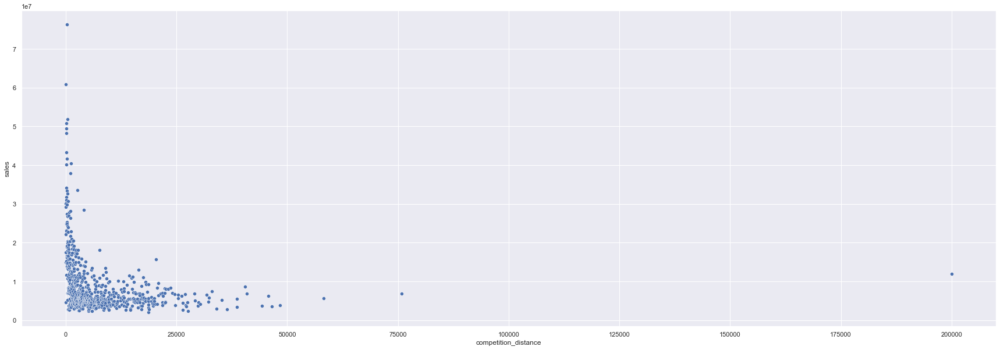
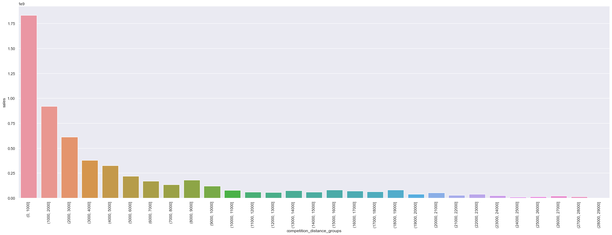
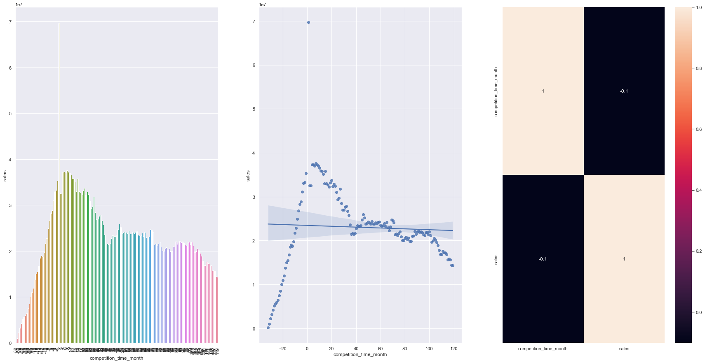
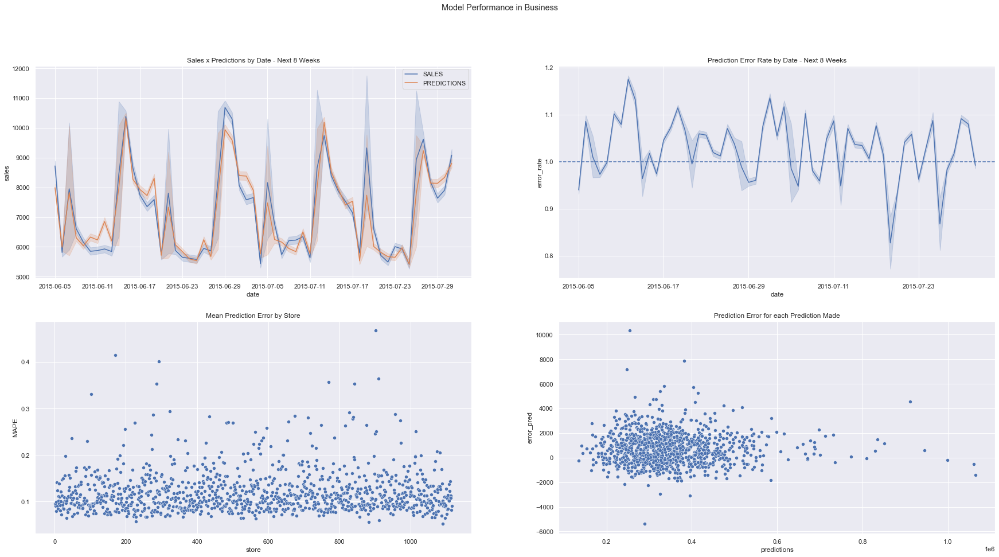
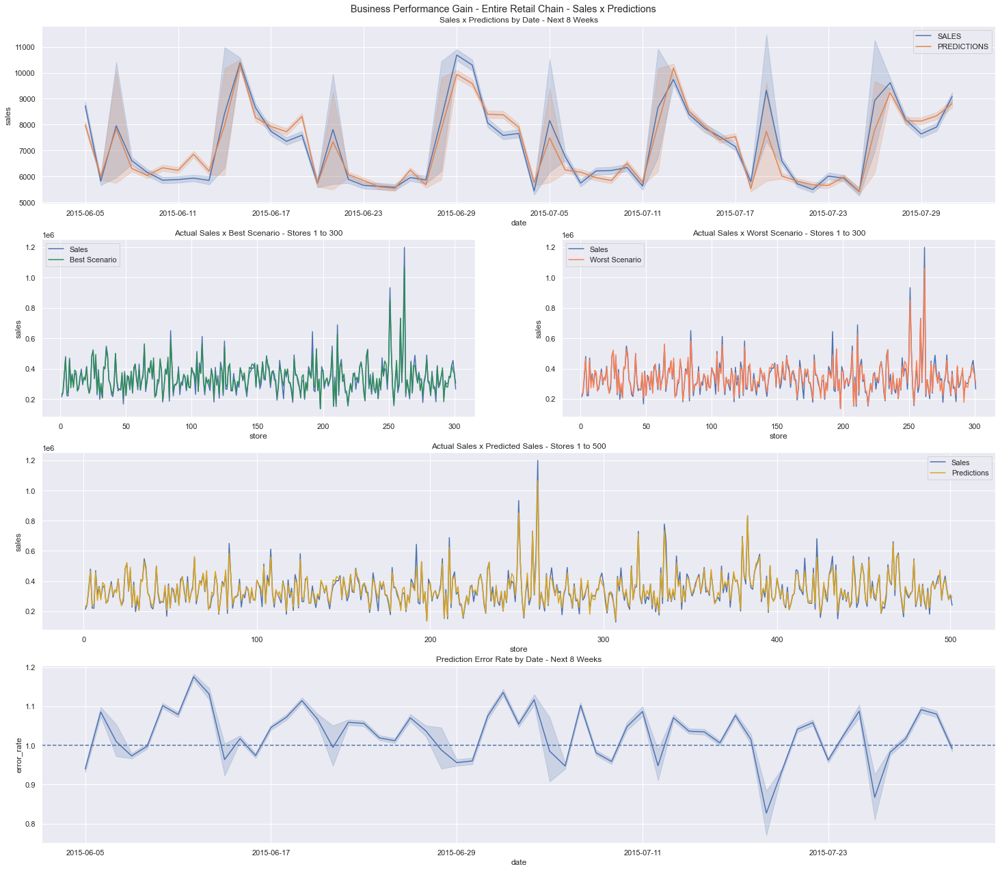

---
# Análisis de ventas de la red de tiendas

#### Proyecto de portafolio sobre un análisis de ventas de una cadena de retail con deploy a través de REST API y Telegram Bot

##### Leia-me em português <p align="left">  ▶<kbd><a href="https://github.com/AndrewLaganaro/Store_Sales_Analysis/" alt="Brazilian">  </a></kbd>◀ </p>

##### Readme in English <p align="left"> ▶<kbd><a href="https://github.com/AndrewLaganaro/Store_Sales_Analysis/blob/main/Readme.en.md" alt="American"> </a></kbd>◀ </p>

#### [](https://andrewcode.herokuapp.com)

##### Autor: Andrew Laganaro

---

## 📜 Sobre el proyecto
### Comprensión empresarial

>“El CFO de una cadena de retail sostuvo una reunión con sus gerentes y dijo que la cadena está en fase de expansión y que aún no existe un modelo de análisis de ventas para la cadena en su conjunto.
>
>Las tiendas están divididas por región y hay muchas. Al tener un modelo predictivo de fácil acceso, el equipo de CFO decidirá desde qué regiones debe comenzar la expansión.
>
>Dicho esto, te pidió que hicieras un informe de análisis de ventas para las próximas 8 semanas (2 meses) que cubriera toda la cadena para ayudarlo a él y a su equipo en el proceso de toma de decisiones".

#### 🚀 Construido con
* 🐍Python
* 📘Poetry
* 🔌FastAPI
* 💻Streamlit
* 🐼Pandas
* 📝Numpy
* 📈Matplotlib
* 📉Seaborn
* 📊Scikit-Learn
* 🪐Jupyter Notebook
* 🐳Docker
* 🖼Drawio

### 🛠 Proyectos

  [](https://github.com/AndrewLaganaro/Store_Sales_Analysis)
  
  [](https://github.com/AndrewLaganaro/Data_Science_Framework)
  
  [](https://github.com/AndrewLaganaro/Data_Science_Classes)

#### ⬇️ Echa un vistazo a mi Portafolio ⬇️
  
  [](https://andrewcode.herokuapp.com)
  
#### 📝 Método utilizado

El método utilizado para construir el proyecto y el análisis de ventas fue **Crisp-DS**.

##### 📊 Esquema Crisp-DS


##### ⚙️ Ciclo de proyecto con Crisp-DS

<center>

</center>

Con diferentes interpretaciones y variaciones, el método elegido se basa en el **Crisp-DS** y presenta las siguientes fases:
- Fase de Análisis
    - Data Collection
    - Data Cleaning
    - Data Analysis
- Fase del modelo de predicción
    - Feature Engineering
    - Model Building
    - Model Evaluation
- Fase de despliegue
    - Visualization and Dashboard
    - API development
    - Web App development

#### 💻🐳🐍 Esquema detallado de lo App

Compuesto por **tres partes principales**, el Frontend, el Backend y el bot de Telegram, el Frontend es la interfaz visual principal en la web donde el usuario puede interactuar con el proyecto, mientras que el Backend es la lógica interna, donde la canalización tiene lugar ciencia de datos, análisis de mensajes y predicción de ventas. El bot de Telegram es donde el usuario puede interactuar con el proyecto enviando mensajes con comandos específicos para devolver una predicción específica de una tienda o muchas.


#### 💻🔌🐍 Esquema detallado de la Api

El endpoint ```/Telegram``` solo se comunica con los servidores de Telegram y, por lo tanto, con el bot de Telegram, mientras que el endpoint ```/Predict``` está expuesto a la web para que el frontend pueda interactuar y enviarle solicitudes según lo desee por el usuario de la aplicación web.


La aplicación Frontend tiene acceso directo solo al endpoint ```/Home```, donde se encuentra la página principal de la aplicación, y tiene acceso indirecto a los endpoints ```/Predict``` y ```/Docs```, este último proporcionado por FastAPI que detalla los endpoints del backend y su respectivas funcionalidades.

#### ✈️🤖🐍 Esquema detallado del bot de Telegram

Se creó un bot de Telegram para implementar el análisis e interactuar con el usuario, se eligió principalmente por su practicidad y facilidad de uso, y puede ser utilizado por el equipo de CFO para obtener pronósticos de manera fácil y rápida.

Al acceder al Bot de Telegram ```@Store_Sales_Analysis_bot``` el usuario puede enviar los siguientes mensajes:

```/start``` - Inicia el bot

```/22``` - Pronostica las ventas de la tienda número 22 en la cadena minorista

```/41``` - Pronostica las ventas de la tienda número 41 de la cadena minorista

Ejemplo de uso:
```
Usuario > /start
Usuario > /22
Bot > Tienda Número 22 venderá R$ 157.217.804 en las próximas 8 semanas
   ```

##### ⭐️ Funciones por agregar

```/all``` - Pronostica las ventas de todas las tiendas en la cadena minorista juntas
```/help``` - Muestra un mensaje de ayuda sobre el bot

### 📝 Cómo usar este proyecto

#### 💻 Requisitos previos

Antes de comenzar, asegúrese de haber cumplido con los siguientes requisitos:

* Ha instalado la última versión de Python.
      * Se requiere al menos Python 3.6.
      * Se recomienda Python 3.8.
* Tienes Telegram instalado.

#### 🚀 Creando un entorno virtual

- 💻🐍 Crea un entorno virtual para este proyecto.
```
...
📁 Data Science ⬅️ 💻 Inicie o seu terminal aqui 💻
    📁 Python_Studies
    ...
```
```
python -m venv Store_Sales_Analysis_env
```
```
...
📁 Data Science
    📁 Python_Studies
    📁 Store_Sales_Analysis_env
    ...
```
- 🐍⚙️ Activación de Python venv

La forma en que active su entorno virtual depende del sistema operativo que esté utilizando.

- 💻 Activación de venv en Windows
```
# En cmd
Store_Sales_Analysis_env\Scripts\activate.bat
```
```
# En PowerShell
Store_Sales_Analysis_env\Scripts\Activate.ps1
```
- 💻 Activación de venv en Linux y MacOS
```
$source Store_Sales_Analysis_env/bin/activate
```

#### 🚀 Instalando las bibliotecas necesarias

En la carpeta Proyecto, busque el archivo `requirements.txt` dentro de las carpetas ```Backend/Build``` y ```Frontend/Build``` y ejecute el siguiente comando para cada una:

```
pip install -r requirements.back.txt
pip install -r requirements.frontal.txt
```
## ☕📊 Leyendo la análisis completa

El **análisis completa** de este proyecto se encuentra en el archivo `Store_Sales_Analysis.ipynb` dentro de la carpeta Notebooks.

Hay **MUCHO** más detalles de los que se han presentado aquí. Recuerda revisarlo más tarde.

### ☕📊 Análisis

Para ilustrar, solo usaremos las principales hipótesis y puntos planteados y desarrollados por el análisis aquí en esta presentación.

Primero, comencemos con un análisis numérico y categórico de los datos.

#### 📈 Atributos numéricos


#### 🔎 Son muchos datos, pero ¿cuál es nuestro **enfoque**?
- Nuestro principal objeto de estudio son las **ventas**, por lo que la columna **'sales'** es la que analizaremos


- Close Median and Mean, indica que no tenemos un desplazamiento muy grande de la curva de distribución normal
- Esto lo confirma la métrica Skew, que está muy cerca de 0, lo que indica que los datos se distribuyen muy cerca de lo normal y con poca desviación hacia la izquierda o hacia la derecha.
- La métrica Skew también indica una pendiente sutil hacia la izquierda, lo que indica lo que llamamos una pendiente positiva
- La métrica de curtosis es mayor que 0, lo que indica que tenemos un pico más alto en la distribución

Visualicemos todo esto con un diagrama de dispersión:


Como podemos imaginar, la distribución es mayormente normal y sesgada hacia la izquierda.

#### 📉 Atributos categóricos

Las mejores variables para analizar son 'state_holiday', 'assortment' e 'store_type', ya que tienen pocas variaciones (a,b,c, etc.) y son más relevantes para nuestro objeto de estudio.

- Evaluemos las ventas con respecto a las vacaciones:


- Analicemos las tres variables 'state_holiday', 'assortment' e 'store_type' en los gráficos:


#### 💰📆 Ventas navideñas:

* Las medianas de los 3 tipos de festivos (**público**, **Semana Santa** y **Navidad**) están muy próximas
* En días festivos **públicos** y **Semana Santa** tenemos un saldo de ventas en los cuartiles superior e inferior (25 y 75)
* En las vacaciones de **Navidad** tenemos más ventas en el cuartil superior (75)
* En los feriados de **Semana Santa** tenemos las ventas máximas más altas de todos los feriados
     - También tenemos la gama más amplia de rebajas entre todos los festivos, lo que indica que clientes de todo tipo compran productos
* La diferencia en el volumen de ventas total y las ventas máximas entre los días normales y los festivos es muy visible, triplicándose el rango en Semana Santa y duplicándose en Navidad

#### 💰🏢 Ventas por tipo de tienda:

* El tipo de tienda **B** tiene la mayor cantidad de ventas en el cuartil superior (75)
    - También tiene el valor máximo más alto entre todas las tiendas
    - También tiene la mayor cantidad de valores atípicos superiores entre todas las tiendas, lo que indica grandes ventas
    - Puede indicar que está ubicado en barrios/ciudades más poblados y ricos
    - Puede indicar que está enfocado en productos más caros y una audiencia más rica

* Los tipos de tienda **A** y **C** tienen un saldo de ventas en los cuartiles superior e inferior (25 y 75) y ambos son muy similares en el nivel de ventas
* El tipo de tienda **A** tiene una mediana de ventas más baja que todas las demás tiendas
    - Sin embargo, su valor máximo de venta es prácticamente igual al valor máximo de venta de las tiendas tipo **C**
    - Puede indicar que ambos están ubicados en barrios cercanos (por la cantidad de ventas, indica poder adquisitivo similar), pero con diferencias significativas en precios/costo de vida
    - Puede indicar que son el tipo de tiendas más comunes, que concentran la mayor parte de la ganancia sobre las ventas ya que atienden a la mayoría de los clientes con ingresos medios/medio-altos
    - Por eso, parecen ser las tiendas más importantes de la cadena.

* El tipo de tienda **D** tiene un saldo de ventas en los cuartiles superior e inferior (25 y 75)
    - Tiene la mayor concentración de valor de venta entre todas las tiendas
    - Tiene las ventas máximas más bajas entre todas las tiendas
    - Puede indicar que atiende a un público más específico o que es un modelo de tienda más nuevo, que aún no ha sido probado al público
    - O que funcione en ciudades pequeñas, con poca variación de precio y pocas promociones
    - También puede haber una gran cantidad de competidores cerca de la tienda tipo D, lo que reduce drásticamente la ganancia
    - Parece ser la tienda menos rentable de la red, ya que es más barata y solo vende productos en un rango de precios específico, lo que limita los ingresos.
    - La sustitución de la tienda tipo **D** por tiendas **A** y **C**, con mayor variedad de ofertas y precios, puede ser una opción

#### 📦💰 Ventas por tipo de stock:

* Los tipos de stock **Básico** y **Extendido** tienen una distribución similar y equilibrada en los cuartiles superior e inferior (25 y 75)
     - **Extendido** tiene más ventas que **Básico** en números absolutos

* El tipo de inventario **Extra** tiene una concentración de ventas balanceada en los cuartiles superior e inferior (25 y 75)
     - Sin embargo, es el tipo de stock que tiene las ventas máximas más altas entre todos los tipos de stock
     - Indicar que el producto puede ser objeto de frecuentes promociones
     - O tener productos con precios más altos
     - O tener los productos más populares de toda la red
    
### ☕📝🧐 Hipótesis de Negocios

Para llegar al Análisis Exploratorio de Datos y saber qué camino tomar, hagamos una lista de hipótesis basadas en tres preguntas para analizar en la siguiente parte del proyecto:

- ¿Qué es el fenómeno modelado?
- ¿Cuáles son los agentes que actúan sobre el fenómeno de interés?
- ¿Cuáles son los atributos de los agentes?

#### 📝 Aquí está nuestro mapa mental de hipótesis:


#### 📊 Las tiendas con promociones activas más largas deberían vender más


Hipótesis 1 es **Falso**, Tiendas con **promociones activas por más tiempo** venden **menos**, luego de un tiempo las ventas caen en el escenario general, a pesar de que inicialmente suben

#### 📊 Las tiendas con competidores más cercanos deberían vender menos.
#### Visualicemos el diagrama de dispersión de las ventas por distancia de los competidores:



- Tenemos muchas más ventas en tiendas con competidores más cercanos
- Cuanto más lejos de los competidores, menos ventas se ven

#### 📊 Veamos un gráfico de barras que agrupa las tiendas por distancia a la competencia



- Este gráfico confirma el primer gráfico de dispersión, cuanto más cerca están los competidores, más ventas ocurren.

#### 📊 Ahora con un gráfico de correlación:


Con correlación negativa, la hipótesis 2 es **falsa**, las tiendas con **competidores más cercanos** venden **más**.

#### 📊 Las tiendas con competidores más antiguos deberían vender más

#### 📊 Veamos las tres gráficas juntas para sacar conclusiones:
- Veamos un gráfico de barras de ventas por meses de competencia, durante los últimos 10 años (120 meses)
- Hagamos un gráfico de regresión polinomial para ver la tendencia de las ventas a lo largo de los meses.



- A partir de los dos primeros gráficos, tenemos una tendencia de que las tiendas con **nuevos competidores** venden más

Sin embargo, la hipótesis 3 es **falsa**, las tiendas con **competidores más antiguos** venden **menos** en el escenario general, a pesar de vender más cuando la competencia es reciente, pronto se estabiliza y cae

#### 📊 Las tiendas deberían vender menos los fines de semana


La hipótesis 4 es **Verdadera**, las tiendas venden menos los fines de semana, especialmente los domingos. Puede reflejar el sector/tipo de productos en los que opera la red minorista. La correlación negativa es muy fuerte, por encima del 70%.

#### 📊🧩 Rendimiento modelo

¿Cómo evaluamos el desempeño del modelo contra el desempeño del negocio? Es decir, ¿obtuvimos mejoras de rendimiento con este nuevo modelo? ¿Cómo medir esto?

Es en esta etapa que verificamos si todo el entrenamiento y refinamiento del modelo valió la pena en comparación con lo que teníamos anteriormente en el negocio.

#### 📊⚙️🧩 Rendimiento del modelo frente a métodos de baseline

Para ello, el problema de negocio ya debe contar con algún tipo de métrica de predicción previa, a través de la cual será posible evaluar el desempeño del modelo.

Como en este caso no tenemos algo que provenga directamente del negocio, vamos a utilizar el modelo de referencia desarrollado en este análisis, que solo toma el promedio de las ventas, asumiendo que vino listo con el problema y que también estamos va a utilizar las métricas del modelo para predecir los posibles incrementos de ingresos, junto con un pronóstico de las mejores y peores ventas.


Como nos muestran los datos, el modelo final es considerablemente mejor que el modelo de referencia, reduciendo el RMSE casi a la mitad en comparación con él, y también superándolo en todas las demás métricas.

#### 📉 Veamos la distribución de errores por pronóstico:


#### ☕📊 Informe final

Aquí veremos lo que hizo el modelo para mejorar el rendimiento comercial al hacer un pronóstico general de ingresos para toda la cadena minorista durante las próximas 8 semanas.

#### 🏢📊 Modelo de desempeño empresarial



#### 🏢💰 Aumento del rendimiento empresarial

Aquí tenemos un gráfico y una tabla con el mejor y el peor escenario de ventas para toda la cadena de tiendas, sumando todas las tiendas, en las próximas 8 semanas.




Con esto, concluimos que después del análisis, la selección de características para el modelo, el modelo entrenado y sus parámetros refinados, el modelo final tiene una **tasa de éxito más alta** que el método utilizado **anteriormente** en **previsión de ventas** de nuestra red minorista.

#### 🎯 Estado general del proyecto


#### 💻 Actualmente en la versión 1.0.0

- [x] Endpoint ```/Telegram``` disponible
- [x] Endpoint ```/Predict``` disponible
- [x] Clase de pipeline de ciencia de datos
- [x] Modelo disponible
- [x] API de back-end principal
    - [x] Verificación de integridad Json
    - [x] Endpoint "Bienvenido" ``` / ``` mientras que lo frontend aún no está listo
- [x] Solicitud de número de tienda con '**/número**', por ejemplo: ```/25```
- [x] Esquema de la API detallado
- [x] Esquema detallado de la APP
- [x] API trabajando en Flask

#### ⭐️ Funciones por agregar

- [ ] Separar el notebook principal en otros más pequeños, por capítulos del análisis
- [ ] Webapp con Streamlit (frontend)
- [ ] Transición de Flask a FastAPI
- [ ] Agregar una base de datos al proyecto para registrar pronósticos
- [ ] Transición de solo solicitud de número de tienda a una solicitud realizada por archivo
- [ ] API de back-end principal
    - [ ] Agregue una función para leer archivos .json a través de API a través de mensajes de Telegram
        - Esto asegurará que siempre podamos enviar nuevos datos a la API
- [ ] Probar la comunicación entre los contenedores backend y frontend

(generated with [Data\_Science\_Framework](https://github.com/AndrewLaganaro/Data_Science_Framework))

(modified from [Cookiecutter-Datascience](https://drivendata.github.io/cookiecutter-data-science/))

---

#### ⬇️ Echa un vistazo a mi Portafolio ⬇️
  
  [](https://andrewcode.herokuapp.com)
  
